# Looking Glass

**Find the one skill worth learning first.**

Career-changers get told to learn *everything*. Looking Glass instead tells you the single
skill that will move the needle most: the one job postings want badly, that hardly anyone
already has. Pick the role you're aiming for, paste your resume, and it shows you exactly
where to focus next, backed by real hiring-market data instead of a guess.

> The name: a looking glass shows you the market as it really is, and where *you* stand in it.

## The problem with most "skills gap" tools

They hand you a list. Fifteen things you're missing, no order, no reasoning, just go learn
them all. That's not a plan, it's a chore list, and it treats every gap as equally important
when they're not even close.

Looking Glass does something different. It ranks your gaps by **leverage** (how much a skill
will actually pay off) and tells you the single best one to start with.

## How it decides what's worth learning

Every skill gap gets scored on two simple questions, both answered from real hiring data, not
opinion:

1. **How many jobs want it?** (demand)
2. **How hard is it for employers to find someone who already has it?** (scarcity)

A skill that's in high demand *and* hard to find is where the leverage is. You're solving a
problem employers are struggling with, instead of competing in a crowded field. A skill that's
in demand but easy to find doesn't pay off nearly as much: plenty of other people already have
it.

**A real example.** Say you're aiming for a Backend Engineer role, and your resume is missing
both *Kafka* and *Redis*. Both show up as in-demand skills. But the data shows Kafka talent is
much harder for companies to hire than Redis talent, so Looking Glass tells you to learn Kafka
first: same payoff, far less competition. Redis can wait.

This is sometimes called the "snowball" approach: instead of spreading your effort thin across
a long list, you knock out the single biggest constraint first, then move down the list once
that's handled.

Every number behind this comes straight from real, public hiring-market research, not an AI
model's opinion, not a guess. No step in the app writes or invents a number; everything you see
is calculated directly and can be traced back to its source data. If you want the exact math,
it's in the [Technical Notes & Methodology](#technical-notes--methodology) section below.

## How it works

1. **Pick your target role**: Backend Engineer, Data Scientist, DevOps, and eleven others.
2. **Paste your resume**: Looking Glass reads it and figures out which of that role's skills
   you already have.
3. **See your gaps, ranked**: everything you're missing for that role, ordered by leverage,
   highest payoff-for-effort first.
4. **Get the one to focus on**: the top gap, with a plain-English reason it beats the others.

There's also an "explore" view for browsing the whole skills market without picking a role
first.

### The visual matrix

Instead of a plain list, gaps are plotted on a simple chart: how in-demand a skill is on one
axis, how scarce the talent is on the other. The further toward the top-right corner, the more
leverage. Skills you already have and skills you're missing are marked separately, so you can
see your whole standing in the market at a glance, not just a table of numbers.

## The data behind it

Looking Glass draws on three public datasets built from real hiring-market research, not
survey opinions, not AI-generated guesses:

- A dataset measuring **how scarce** different tech skills are to hire for, plus salary premiums
  and how long roles stay open.
- A dataset measuring **how in-demand** each skill currently is across job postings.
- A large dataset of **360,000+ real job postings**, used to double-check demand and to build
  the skill profile for each of the 15 roles.

Where all three datasets agree, a skill gets an extra "confirmed" badge in the app, so you know
that number isn't resting on a single source.

> **Note:** not every role has equally rich data. Technical roles like Backend or
Data Engineering have deep coverage; most of their skills carry a full leverage score. Roles
like Product Manager or Designer have thinner coverage in these particular datasets, so more of
their gaps show up flagged as "we know it's in demand, but we don't have enough data yet to
say how scarce it is," rather than silently guessing. The app tells you which situation you're
in rather than hiding the gap in the data.

## Try it

The app is live: **[looking-glass-zeta.vercel.app](https://looking-glass-zeta.vercel.app/)**

Everything described above, picking a role, pasting a resume, seeing your ranked gaps, and
getting the top recommendation, is built, tested, and working end to end.

---

## Technical Notes & Methodology

### System Architecture & Execution Flow

```mermaid
flowchart LR
    %% Class Definitions
    classDef frontend fill:#e0f7fa,stroke:#00838f,stroke-width:2px,color:#000
    classDef backend fill:#f3e5f5,stroke:#6a1b9a,stroke-width:2px,color:#000
    classDef external fill:#fff3e0,stroke:#ef6c00,stroke-width:2px,color:#000

    %% External Data
    CSV[\Kaggle CSVs: D1, D2, D3\]:::external

    subgraph Server [Backend: Supabase Postgres]
        Ingest(Data Ingestion<br/><i>Python / SQL</i>):::backend
        DB[(Core Database)]:::backend
        ScoreView[(Arbitrage Score View<br/><i>Demand × Scarcity</i>)]:::backend
    end

    subgraph Client [Frontend: React + TypeScript SPA on Vercel]
        UI([User Interface]):::frontend
        Regex(Resume Skill Extraction<br/><i>Deterministic Regex</i>):::frontend
        Matrix(Demand × Scarcity Matrix<br/><i>Gap Ranking</i>):::frontend
        Narrator(Narrative Engine<br/><i>Deterministic Templates</i>):::frontend
    end

    %% Build time / Static
    CSV == 1. Ingest & Join ==> Ingest
    Ingest ==> DB
    DB == 2. Compute View ==> ScoreView

    %% Runtime Flow
    UI -->|3. Select Role| ScoreView
    ScoreView -.->|Role Profile & Scores| Matrix
    
    UI -->|4. Paste Resume| Regex
    Regex -->|Extracted Skills| Matrix
    Matrix -->|Top Gap| Narrator
    Narrator -.->|5. Rationale| UI
```



### How it was built

[**Development Report**](DEVELOPMENT_REPORT.md) — the full build history from the first commit
to the post-mortem: what shipped, what was deleted, the AI layer that was built and then removed,
the one CSS bug that survived four rounds and 622 green tests, and what the team changed about
its own process afterward.

### The score, precisely

```
demand_score     = d2_demand_pct
scarcity_index   = 0.6 * scarcity_score
                 + 0.2 * min(salary_premium_pct, 100)      [if present]
                 + 0.2 * min(median_days_open, 60) / 60 * 100  [if present]
                   (weights renormalize, never zero-substitute, when a term is missing)
leverage_score   = demand_score * scarcity_index
```

- **Demand**: `demand_score` is `d2_demand_pct` verbatim, from the Skill Demand Index (D2). D1
  also carries a demand figure, but it's kept only as a passthrough audit field, never averaged
  in. Blending two datasets' demand numbers would fabricate a figure not traceable to one real
  source row; D2 is the one dataset actually scoped as the demand index with a documented
  denominator.
- **Scarcity**: `scarcity_index` is a weighted composite: `scarcity_score` (weight 0.6, always
  present, never clipped) + salary premium (weight 0.2, clipped at 100%) + median days a role
  stays open (weight 0.2, capped at 60 days). Salary premium and days-open are nullable for some
  skills; when one is missing, its weight isn't zero-substituted. The remaining weights
  renormalize proportionally, and a `scarcity_data_completeness` label (`full` /
  `missing_salary_premium` / `missing_days_open` / `missing_both`) travels with the score so no
  consumer mistakes a partial-data score for a complete one.
- **D3 corroboration**: whether a skill is confirmed in D3's 360k+ postings is a separate badge
  field (`d3_corroborated` / `d3_pct_of_all_postings`), never blended into the numeric score.

Both axes come straight from the source data, and the formula reads each row's own fields only,
no dataset-wide statistics, so any single score is reproducible and auditable in isolation.
Internally this is called the `arbitrage_score`; the product surfaces it to users as "leverage"
since that's the plainer word for the same number.

> **Note on the "2026 prediction" axis.** An earlier design imagined a third,
> forward-looking axis. The source datasets are all *current snapshots*, not forecasts, so
> the honest model is two-axis: **demand × scarcity**. Cleaner, and fully grounded in data.

### Data sources

Three public Kaggle datasets, joined on skill name:

| # | Dataset | Role | Distinct skills |
|---|---------|------|-----------------|
| D1 | [Skill Scarcity Index](https://www.kaggle.com/datasets/datamatastudios/skill-scarcity-index) ("Hardest Tech Skills to Hire For") | Scarcity: `scarcity_score`, `salary_premium_pct`, `median_days_open` + demand | 141 |
| D2 | [Skill Demand Index](https://www.kaggle.com/datasets/datamatastudios/skill-demand-index) | Demand: `demand_pct`, `required_count`, `skill_group` | 148 |
| D3 | [Most In-Demand Job Skills 2026](https://www.kaggle.com/datasets/alpha21/most-in-demand-job-skills-2026) (360k+ postings) | Demand corroboration + **per-role skill profiles** (`skills-2026-by-role.csv`: 15 roles × top 30 skills) | 250 |

*Re-validated against the raw CSVs on 2026-07-22: D1+D2 core is 141 (not the earlier 139) and
D2's own distinct-skill count is 148 (not 147); both are now locked in as passing, enforced
assertions in `tests/test_data_invariants.py`.*

#### The join strategy (validated)

A three-way join was tested by normalizing skill names (case, punctuation, whitespace):

- **D1 ∩ D2 = 141**, a near-perfect join (same publisher, same taxonomy). This is the
  **core**: every skill carries both demand and scarcity signal. (D2 has 7 skills D1 lacks:
  `duckdb`, `qlik`, `r`, `ray`, `streamlit`, `supabase`, `talend`.)
- **Three-way ∩ = 58**. D3 uses a coarser, lowercase, single-token vocabulary
  (`ai`, `cloud`, `python`), so most of its 250 skills are generic soft skills or broad
  buckets absent from the tech-focused D1/D2.

Rather than force a lossy three-way join (which would discard 83 good skills), Looking Glass:

- builds its **141-skill core on D1 + D2**, and
- uses **D3 as an enrichment badge**: for the 58 skills it corroborates, the UI marks demand
  as "confirmed across 360k+ postings" (higher confidence).

All three datasets contribute; none is thrown away.

#### Role coverage (why score density varies by role)

A target role's 30 skills come from D3's coarse vocabulary, so how many of them carry a real
leverage score varies by role. Technical/engineering roles are dense with hard skills that
live in the D1+D2 core; softer roles are mostly generic skills the tech-focused source data
doesn't score:

| Coverage | Roles | Skills with a leverage score |
|---|---|---|
| **Strong** | Backend, Full Stack, Data Scientist/ML, Data Engineer, Software Engineer, DevOps/Cloud/SRE | 15-22 of 30 |
| Moderate | Frontend, Data Analyst/BI, Mobile | 8-9 of 30 |
| Weak | Security, QA, Business Analyst, Designer, Product Manager, Project/Program Mgr | 3-6 of 30 |

**All 15 `role_family` values ship.** A skill that appears in a role but has no leverage score
still surfaces as a gap, flagged *"demand only, scarcity unknown"* rather than silently dropped.

### Build order (walking skeleton)

**All five steps below are complete and live-verified end-to-end**, against the real Supabase
database, with zero AI-model calls anywhere in the flow:

1. **Ingest** the three CSVs into Supabase; resolve the D1+D2 skill join (141-skill core) and
   the D3 per-role skill profiles.
2. **Compute** a deterministic `arbitrage_score` (leverage score) view (demand × scarcity), with
   D3 confidence badges.
3. **Role picker**: select any of the 15 `role_family` values; show its skill profile on the
   demand × scarcity matrix.
4. **Resume gap layer**: paste a resume, extract skills, subtract from the role profile,
   highlight *your* gaps on the matrix, ranked by leverage score.
5. **Narrative**: a short "learn X before Y, here's why" rationale for the top gap.

> Steps 4 and 5 are both fully deterministic, no AI model in the loop. Step 5's narration is a
> template engine: every fact the rationale needs (demand, scarcity, salary premium, days-open,
> the exact rank ordering) is already computed by this stage, so a template function states the
> *precise* mathematical reason one gap outranks another, with zero latency, zero cost, and zero
> risk of a hallucinated number. Step 4's resume-skill extraction uses vocabulary-scoped regex
> matching (matching only against the *selected role's* own skill list, not the full skill
> catalog); its known, honestly-documented limits are that `r` can still false-match inside
> "R&D," and a negation cue ("no Kubernetes experience") outside its scan window can still slip
> through. No alias/synonym folding is implemented yet.

### Explicitly out of scope for V1

User accounts / saved plans, cohort aggregation, syllabus/curriculum auditing, the moderate-
and weak-coverage roles, skill-alias fuzzy matching (a V2 refinement that would lift D3
coverage), and any forward-looking forecast axis.

### Planned V2 scope expansion

Four candidates were scoped on `feature/v2-scope-expansion`, all deterministic (Bounded-AI
discipline still applies — no LLM calls). All four are now resolved — three shipped, one
evaluated and parked:

- **Skill-alias fuzzy matching** *(shipped)* — a static, curated alias table (e.g. `k8s` →
  Kubernetes, `postgres` → PostgreSQL) extending step 4's existing boundary/overlap/negation
  matching, so common abbreviations no longer fall through as silent false negatives. See
  [specs/025-skill-alias-fuzzy-matching.md](specs/025-skill-alias-fuzzy-matching.md).
- **Category-level granularity in the UI** *(shipped)* — surfaces per-`skill_group` breakdowns
  (already carried by D1/D2) on the matrix, so a user can see *which* category is driving their
  score, not just the blended per-role number. See
  [specs/026-skill-group-breakdown.md](specs/026-skill-group-breakdown.md) and
  [specs/027-skill-group-breakdown-ui.md](specs/027-skill-group-breakdown-ui.md).
- **Seniority in the target-role picker** *(shipped)* — lets the role picker narrow by level, not
  just `role_family`, and gives the AI Requirements Index's one robust cut (its seniority
  gradient — see [data/dataset-evaluations.md](data/dataset-evaluations.md)) something to attach
  to as context-only framing copy, never a score input. See
  [specs/028-seniority-role-picker.md](specs/028-seniority-role-picker.md) and
  [specs/029-seniority-role-picker-ui.md](specs/029-seniority-role-picker-ui.md).
- **Role expansion via the LinkedIn postings dataset** (arshkon set) *(evaluated, rejected as
  proposed)* — the pre-built skill join turned out to be the same wrong-grain failure that
  rejected the AI Requirements Index (its 36-value `skill_abr` field is a job-function taxonomy,
  not a skill vocabulary), and the postings themselves are a general cross-industry crawl skewed
  away from this app's 15 tech-only roles. A narrower path — deterministic skill-mention
  extraction from the postings' free-text descriptions, corroborated with real per-posting
  timestamps — tested viable but is parked pending a fresher pull (the current one is a
  2023–2024 crawl). Full verdict in
  [data/dataset-evaluations.md](data/dataset-evaluations.md).

### Stack

- **Data / DB**: Supabase (Postgres); deterministic scoring in SQL / Python.
- **Frontend**: React + TypeScript (Vite SPA); the demand × scarcity matrix.
- **Deploy**: Vercel (`frontend/vercel.json`, root directory scoped to `frontend/`), live at
  [looking-glass-zeta.vercel.app](https://looking-glass-zeta.vercel.app/); Supabase hosted (DB).
> **AI layer**: REMOVED. none currently in the runtime path (resume-skill extraction and narration are
  both fully deterministic).

### Status

The full product described above is built, live-verified, and deployed against the real
Supabase database, for all 15 target roles, with zero AI-model calls anywhere in the flow. Since
first shipping, the project has gone through multiple hardening passes: role coverage widened
from 6 to all 15 roles; accessibility passes (WCAG 2.2 AA) on empty/loading states, the scatter
legend, touch/motion, and salary-premium phrasing; and a light/dark-mode contrast,
responsive-layout, and visual-design pass across the whole app, including a post-ship dark-mode
regression caught from a real user screenshot and fixed.

Three deterministic V2 features have since shipped on top of that base — skill-alias fuzzy
matching, a skill-group-level breakdown/filter, and seniority-aware framing copy in the role
picker (see "Planned V2 scope expansion" below). A fourth, separate UI initiative is in
progress: a design-handoff-driven restructure of the results column from four sibling cards into
two, **Standing** and **Evidence** (specs
[030](specs/030-filter-status-bar.md)–[033](specs/033-results-column-two-card-shell.md)). Three
of those four specs are shipped; the fourth (assembling the two-card shell in `App.tsx`) has not
been started, and spec 032's Cypress compliance audit was cut off mid-run (a session API limit,
not a failure) and needs a clean re-run before that step is trusted complete.

The full automated test suite passes as of this writing: 722/722 vitest, 239 pytest (+16 cleanly
skipped), 59/68 Playwright e2e (9 skipped as expected pointer-mode mismatches for the profile
they're tagged to), ruff/eslint/tsc all clean. Next: finish the results-column restructure
(re-run the spec 032 audit, then build spec 033); after that, the moderate-coverage roles or a
genuinely new feature is unspecced.

---

*Built for the Pursuit AI Native Fellowship.*
